# Digithics Project

## Overview
Digithics is a digital platform dedicated to raising awareness about dark patterns and deceptive practices on the web. The platform educates users about these unethical design patterns and provides a portal for reporting instances of dark patterns they encounter online. Our mission is to empower users to recognize and report these manipulative tactics, fostering a more transparent and user-friendly web experience.

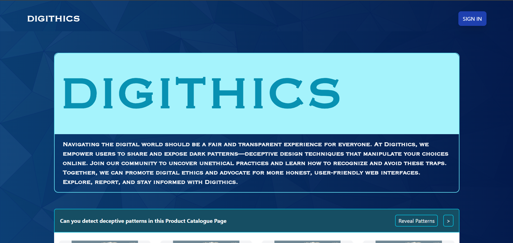

## Features

### User End
- **Educational Resources**: Access detailed information about various types of dark patterns, including examples and explanations.

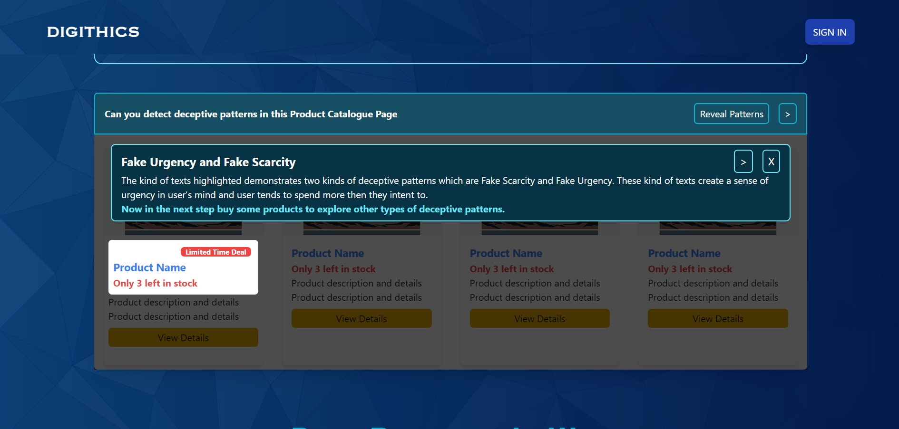

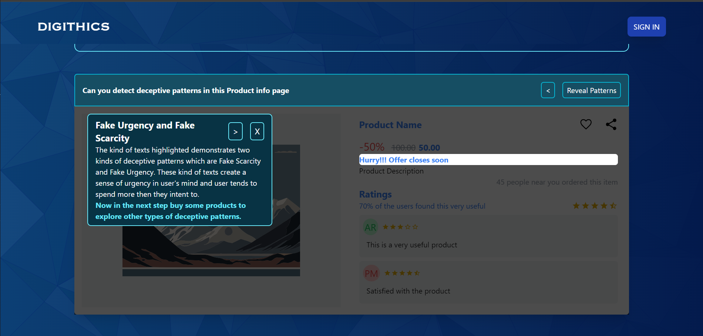

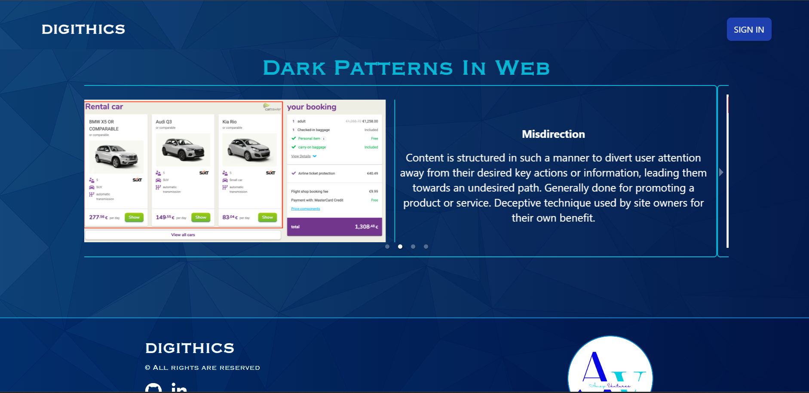

- **Dark Pattern Reporting**: Report dark patterns you come across on any website. Submissions include details such as screenshots, URLs, and descriptions of the manipulative behavior.
- **User Interaction**: Engage with the community by viewing reported dark patterns and discussing them through comments. Users can also upvote and downVote the reported websites.

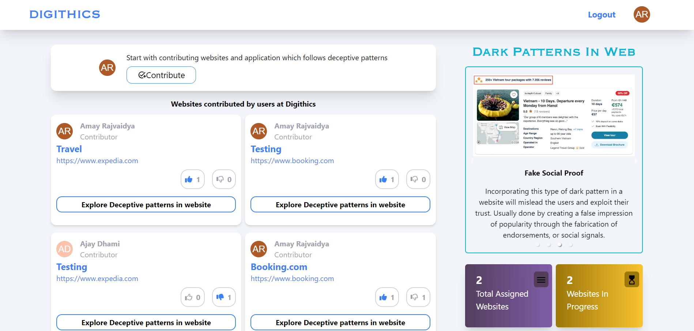

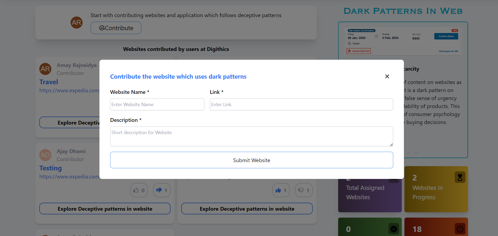

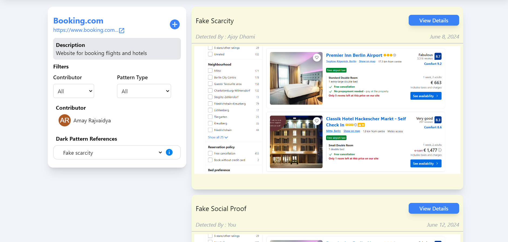

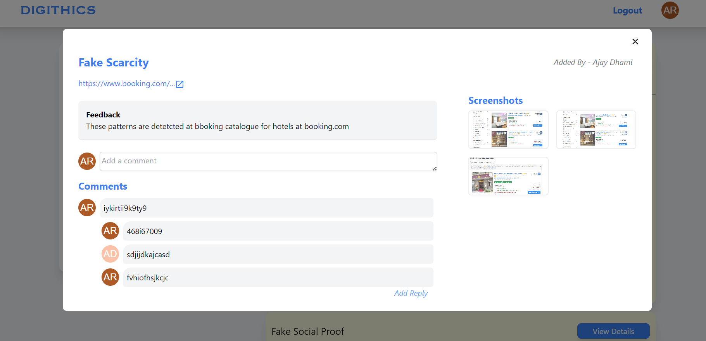

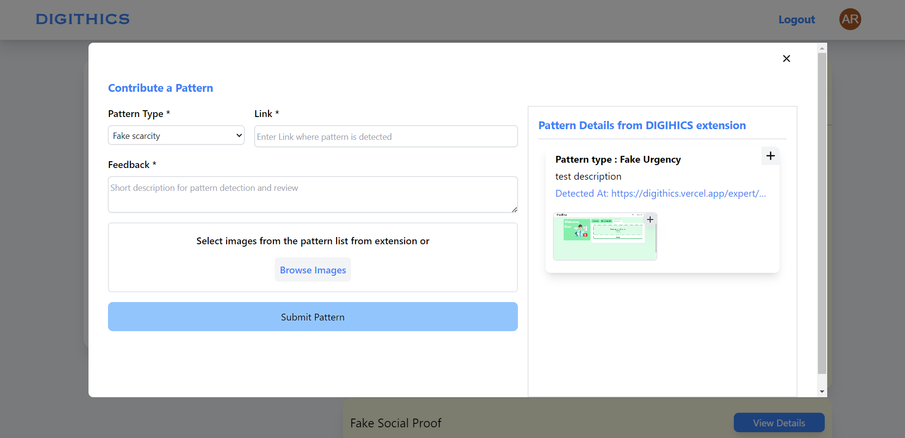

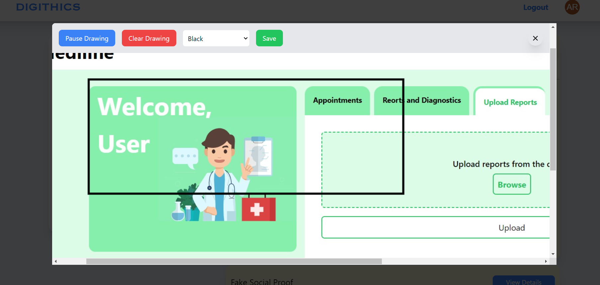

## Mobile UI

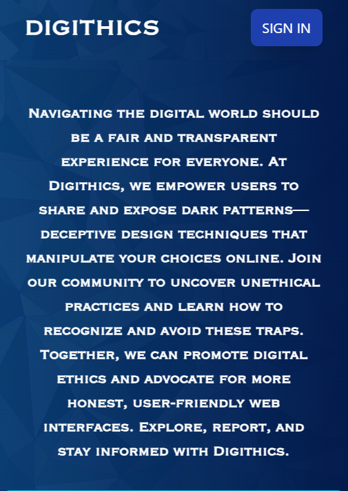

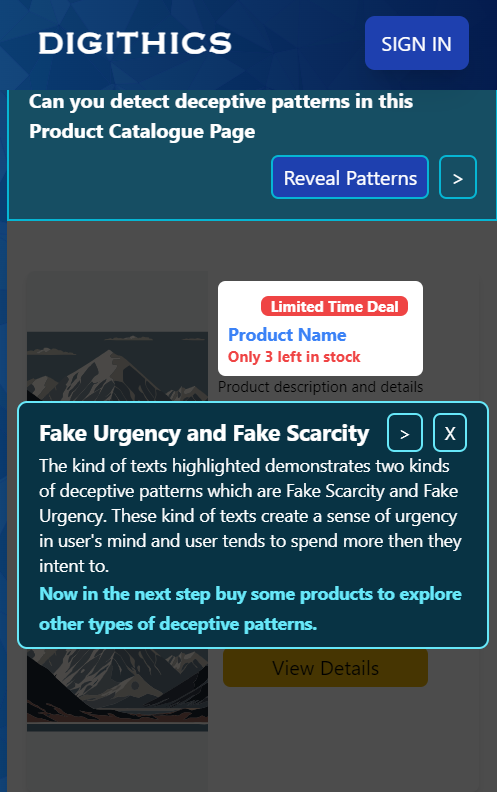

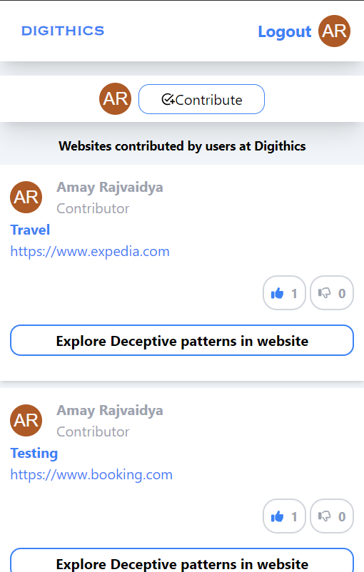

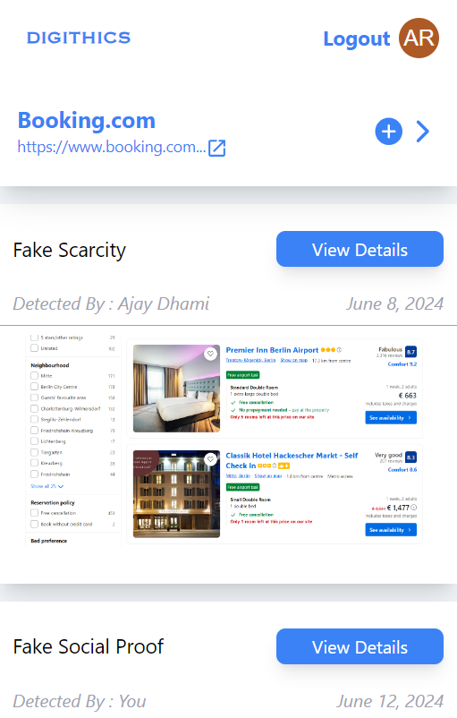

## Technology Stack

### Frontend
- **React.js**: A popular JavaScript library for building the user interface, ensuring a responsive and interactive experience.
- **Axios**: For making HTTP requests from the frontend to the backend API.

### Backend
- **NestJS**: A progressive Node.js framework for building efficient and scalable server-side applications.
- **TypeORM**: An ORM (Object-Relational Mapping) tool for managing database interactions with strong typing support.
- **MongoDB**: A powerful, open-source NoSQL database used to store user data, reports, and content.

